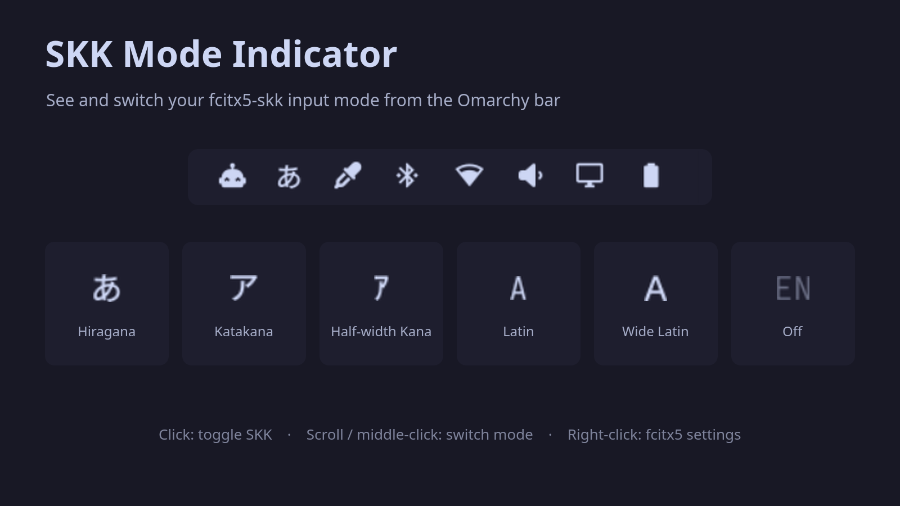

# SKK Mode Indicator



An Omarchy shell bar widget for [fcitx5-skk](https://github.com/fcitx/fcitx5-skk).
It shows whether SKK is on and which input mode it is in, and lets you switch
both from the bar.

| State                 | Label        |
|-----------------------|--------------|
| Hiragana              | `あ`         |
| Katakana              | `ア`         |
| Half-width Katakana   | `ｱ`          |
| Latin                 | `A`          |
| Wide Latin            | `Ａ`         |
| Off (fcitx5 inactive) | `A` (dimmed) |

Hovering the widget shows the full mode name, e.g. `SKK: あ - Hiragana`.
The widget hides itself while fcitx5 is not running.

## Requirements

- Omarchy shell (Quickshell)
- fcitx5 with fcitx5-skk, and `skk` added to the input method group
- `fcitx5-remote`, `busctl` (systemd) and `dbus-monitor` (dbus) on `PATH`
- fcitx5's tray icon (StatusNotifierItem) enabled, which is the default

## Installation

Place this directory at `~/.config/omarchy/plugins/skk-mode-indicator/`, then add the
widget to the bar:

```bash
omarchy bar put skk-mode-indicator --section right
```

If the widget does not pick up changes to its files, restart the shell:

```bash
omarchy restart shell
```

## Usage

| Action        | Effect                                           |
|---------------|--------------------------------------------------|
| Left click    | Toggle SKK on/off (same as `fcitx5-remote -t`)   |
| Middle click  | Switch to the next SKK input mode                |
| Mouse wheel   | Cycle SKK input modes forward / backward         |
| Right click   | Open `fcitx5-configtool`                         |

Mode switching only works while SKK is on.

## Settings

Settings are stored on the widget's entry in `~/.config/omarchy/shell.json`
and can be changed with `omarchy bar set`.

| Key        | Default             | Description                                   |
|------------|---------------------|-----------------------------------------------|
| `offLabel` | `"A"`               | Label shown while SKK is off                  |
| `cycle`    | `["あ", "ア", "A"]` | Modes the wheel and middle click cycle through, by label |

```bash
# Show "EN" while SKK is off
omarchy bar set skk-mode-indicator offLabel EN

# Include half-width Katakana and Wide Latin in the cycle
omarchy bar set skk-mode-indicator cycle '["あ","ア","ｱ","A","Ａ"]' --json
```

## How it works

fcitx5 has no D-Bus signal for its active state or for the SKK input mode,
but its tray item emits `NewIcon` whenever either changes. The widget keeps
a `dbus-monitor` watching for that signal and refreshes when it arrives, so
the label updates immediately without polling. It also refreshes when the
focused window changes, since the fcitx5 state can be per window, and every
10 seconds as a fallback.

On each refresh, `skk-state.sh` reports:

1. the fcitx5 state and current input method (`fcitx5-remote`, `fcitx5-remote -n`)
2. the D-Bus name of fcitx5's tray item, found through `StatusNotifierWatcher`
3. the tray's dbusmenu layout

The SKK mode is read from the submenu whose label matches its checked
item (e.g. `あ - Hiragana`). Mode switching sends a `clicked` event to
the matching menu item.

## Files

| File            | Purpose                                  |
|-----------------|------------------------------------------|
| `manifest.json` | Plugin manifest                          |
| `BarWidget.qml` | The bar widget                           |
| `skk-state.sh`  | Reads fcitx5 state and the SKK mode menu |

## Limitations

- Latin mode and the off state both show `A`; they differ only in being
  dimmed. Set `offLabel` to tell them apart.
- The mode is read from fcitx5's tray menu, so the widget cannot show
  the mode if the tray icon is disabled.

## License

MIT. See [LICENSE](LICENSE).
